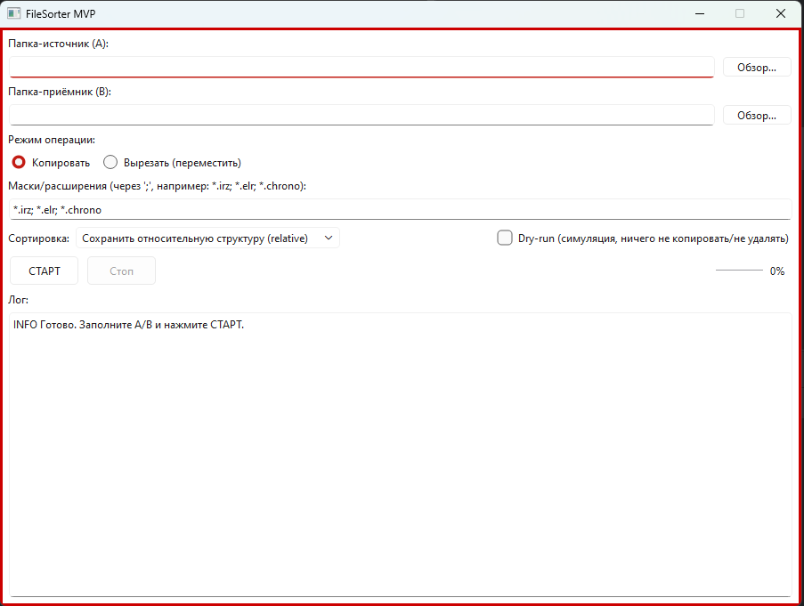

# 📦 FileSorter MVP

Простое desktop-приложение на Python для автоматической сортировки файлов по заданным правилам.

---

## 🚀 Возможности

- 📂 Рекурсивный обход папок
- 🔍 Фильтрация по расширениям (`.irz`, `.elr`, `.chrono` и др.)
- 🧠 Интеллектуальный парсинг имени файла:
  - Месторождение
  - Куст
  - Скважина
- 📁 Автоматическое создание структуры папок:
  ```
  ЦДНГ → Месторождение → Куст → Скважина
  ```
- 🔁 Режимы работы:
  - Копирование
  - Перемещение (вырезать)
- ⚖️ Обработка конфликтов:
  - Сравнение по дате изменения
  - Замена только если файл новее
- 🧾 Логирование операций (успех / пропуск / ошибка)
- 🧹 Очистка пустых папок (в режиме перемещения)

---

## 🖼️ Скриншоты

> Добавь сюда изображения интерфейса




---

## 📦 Скачать

👉 Последний релиз:

🔗 https://github.com/NuDaVot/filesorter_mvp/releases/tag/version_0.1

---

## ⚙️ Установка

### Вариант 1 — готовый `.exe`
Скачай из раздела Releases и просто запусти.

---

### Вариант 2 — запуск из исходников

```bash
git clone https://github.com/NuDaVot/filesorter_mvp.git
cd filesorter_mvp

pip install -r requirements.txt
python filesorter/app.py
```

---

## 🧪 Пример работы

### Было:

```
A/
 ├── Местор4 куст43 скв2367.irz
 ├── Журнал 2026_02_07 - Куст_38 Скв_2275.elr
```

### Стало:

```
B/
 ├── Местор4/
 │    ├── Куст-43/
 │    │     └── 2367/
 │    │           └── файл.irz
 │    ├── Куст-38/
 │          └── 2275/
 │                └── файл.elr
```

---

## ⚙️ Настройки

В интерфейсе можно задать:

- Папку источник (A)
- Папку приёмник (B)
- Тип операции (копировать / переместить)
- Список расширений:
  ```
  *.irz; *.elr; *.chrono
  ```

---

## 🧠 Особенности логики

- Поддержка разных форматов:
  - `Местор4 куст43 скв2367`
  - `MECT-4 KYCT-43 CKB-2390`
  - `Куст_15 Скв_2232`
- Парсинг через регулярные выражения
- Возможность расширения через конфиг

---

## ⚠️ Ограничения MVP

- Нет расписания (только ручной запуск)
- Нет работы в фоне
- Парсинг может требовать донастройки под новые форматы

---

## 🛠️ Технологии

- Python 3.10+
- pathlib
- shutil
- regex
- (GUI: tkinter / PyQt — зависит от реализации)

---

## 📁 Структура проекта

```
filesorter/
 ├── core/
 │    ├── models.py
 │    ├── utils.py
 │    ├── mapper.py
 │
 ├── ui/
 ├── main.py
 └── settings.json
```

---

## 📜 Лицензия

MIT License

---

## 🤝 Контрибьютинг

PR'ы приветствуются 👍  
Если есть идеи — создавай issue.

---

## 📬 Контакты

GitHub: https://github.com/NuDaVot
