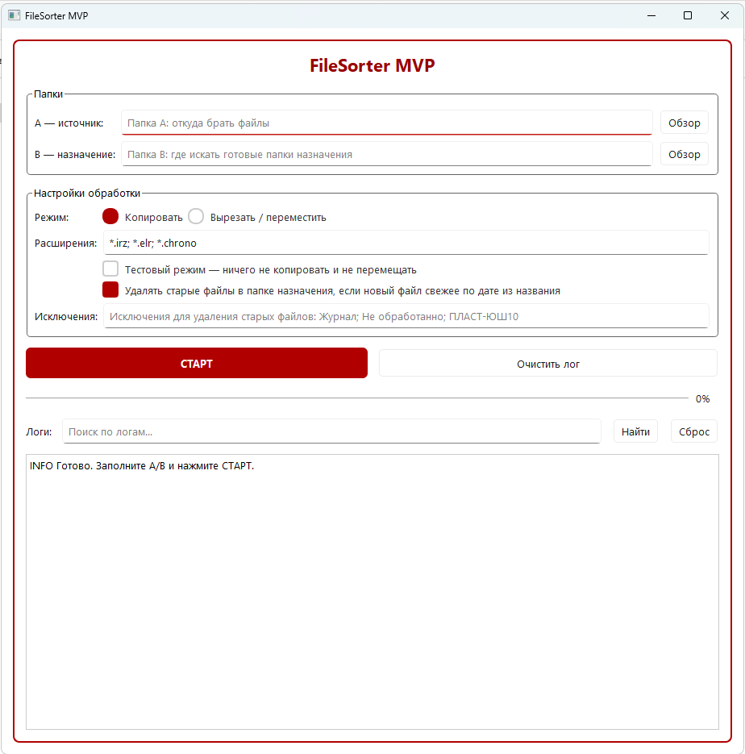

# 📦 FileSorter MVP


**FileSorter MVP** — desktop-приложение для Windows, которое копирует или перемещает файлы из папки **A** в уже существующую структуру папок в **B**.

Программа предназначена для сортировки файлов по месторождению, кусту и скважине на основе имени файла.

---

## 🚀 Скачать

Последний релиз:

👉 https://github.com/NuDaVot/filesorter_mvp/releases/tag/version_1_0

---

## Скриншоты



---

## 🧩 Основная идея

Программа **не создаёт лишние папки в B**.

Она работает так:

1. Берёт файл из папки **A**.
2. Читает из имени файла:
   - месторождение;
   - куст;
   - скважину;
   - дату и время.
3. Ищет подходящую уже существующую папку в **B**.
4. Копирует или перемещает файл туда.
5. Если папка назначения не найдена — отправляет файл в:

```text
A\Не обработанно\
```

---

## 📁 Пример

### Папка A

```text
A/
├── MECT-4 KYCT-35 CKB-2332 04_02_2026 12-37.chrono
├── Журнал 2026_02_03 17-46-43 - Куст_44 Скв_2438.elr
├── Местор4 куст28 скв2198 ИРЗ-500 №240143177 2026_2_3 16ч50м54с.irz
```

### Папка B

```text
B/
├── Местор4/
│   ├── Куст-28/
│   │   └── Скв-2198/
│   ├── Куст-35/
│   │   └── Скв-2332/
│   └── Куст-44/
│       └── Скв-2438/
```

### Результат

```text
B/
├── Местор4/
│   ├── Куст-28/
│   │   └── Скв-2198/
│   │       └── Местор4 куст28 скв2198 ... 2026_2_3 16ч50м54с.irz
│   ├── Куст-35/
│   │   └── Скв-2332/
│   │       └── MECT-4 KYCT-35 CKB-2332 04_02_2026 12-37.chrono
│   └── Куст-44/
│       └── Скв-2438/
│           └── Журнал 2026_02_03 17-46-43 - Куст_44 Скв_2438.elr
```

---

## ✅ Возможности

### 📂 Выбор папок A и B

В интерфейсе можно выбрать:

- **A — источник**: откуда брать файлы;
- **B — назначение**: где искать готовые папки.

Папка **B** должна содержать уже готовую структуру. Программа не создаёт новые кусты и скважины в B.

---

### 🔎 Поиск готовой папки назначения

Программа ищет папку назначения по данным из имени файла.

Поддерживаются форматы:

```text
Местор4 куст28 скв2198
MECT-4 KYCT-35 CKB-2332
Журнал 2026_02_03 17-46-43 - Куст_44 Скв_2438
```

Примеры соответствий:

```text
CKB-2332     → Скв-2332
CKB-2332А    → Скв-2332
CKB-2332в    → Скв-2332
Скв_2438     → Скв-2438
куст28       → Куст-28
KYCT-35      → Куст-35
```

---

### 🧠 Скважины с буквами

Файлы вида:

```text
CKB-2332
CKB-2332А
CKB-2332в
```

считаются относящимися к одной скважине:

```text
2332
```

Это нужно, чтобы программа правильно сравнивала старые и новые файлы одной скважины.

---

### ⚠️ Мятая скважина

Если папка скважины в B названа с лишним текстом, например:

```text
CKB-2332в какие-то буквы
Скв-2332А лишний текст
```

программа не переносит туда файл.

Файл отправляется в:

```text
A\Не обработанно\
```

В логе появится причина:

```text
Мятая скважина
```

---

### 📅 Сравнение файлов по дате из имени

Программа сравнивает файлы **не по дате Windows**, а по дате и времени из названия файла.

Поддерживаются форматы:

```text
03_02_2026 10-37
03_02_2026 09-52
2026_2_3 16ч50м54с
2026_02_03 17-46-43
10ч39м8с
```

Пример:

```text
MECT-4 KYCT-35 CKB-2332 03_02_2026 11-37.chrono
MECT-4 KYCT-35 CKB-2332 04_02_2026 12-37.chrono
MECT-4 KYCT-35 CKB-2332 04_05_2026 12-37.chrono
```

Самым свежим считается:

```text
MECT-4 KYCT-35 CKB-2332 04_05_2026 12-37.chrono
```

---

### 🗑️ Удаление старых файлов

В интерфейсе есть флажок:

```text
Удалять старые файлы в папке назначения, если новый файл свежее по дате из названия
```

Если флажок включён, программа:

1. Находит в папке назначения файлы той же скважины и того же типа.
2. Сравнивает даты из имени.
3. Удаляет старые файлы.
4. Копирует или перемещает новый файл.

Пример:

```text
B\Местор4\Куст-35\Скв-2332\
├── MECT-4 KYCT-35 CKB-2332 03_02_2026 11-37.chrono
```

При поступлении файла:

```text
MECT-4 KYCT-35 CKB-2332 04_02_2026 12-37.chrono
```

старый файл будет удалён, а новый будет записан.

---

### 🚫 Исключения для удаления старых файлов

В интерфейсе можно указать папки, где старые файлы удалять нельзя.

Пример:

```text
Журнал; Не обработанно; ПЛАСТ-ЮШ10
```

Если папка назначения попадает в исключения, программа:

- не удаляет старые файлы;
- может скопировать новый файл, если это разрешено логикой обработки.

---

### 📦 Папка `Не обработанно`

Если программа не нашла подходящую папку в B, файл отправляется в:

```text
A\Не обработанно\
```

Важно:

- папка создаётся в **A**, а не в B;
- в B лишние папки не создаются;
- в логах указывается причина, почему файл не попал в B.

---

### 🧾 Подробные логи

В программе есть подробный лог обработки.

Для каждого файла видно:

```text
Файл A
Куда должен попасть
Действие
Почему выполнено или пропущено
Код причины
```

Пример успешной операции:

```text
OK
Файл A: C:\...\MECT-4 KYCT-35 CKB-2332 04_02_2026 12-37.chrono
Куда:   C:\...\Местор4\Куст-35\Скв-2332\...
Действие: скопировать
Почему: папка назначения найдена
```

Пример пропуска:

```text
SKIP
Файл A: C:\...\Журнал 2026_02_03 17-46-43 - Куст_44 Скв_2438.elr
Куда:   C:\...\A\Не обработанно\...
Действие: не переносить
Почему: подходящая папка назначения не найдена
```

---

### 🔍 Поиск по логам

В интерфейсе есть строка поиска по логам.

Можно искать:

```text
Мятая скважина
target_folder_not_found
CKB-2332
SKIP
ERR
```

Кнопка **Найти** переходит к следующему совпадению.

---

### 🧪 Тестовый режим

Есть режим:

```text
Тестовый режим — ничего не копировать и не перемещать
```

Он нужен для безопасной проверки.

В этом режиме программа строит план и показывает, что бы она сделала, но файлы не изменяет.

---

### 🧹 Пропуск нулевых файлов

В программе есть скрытая настройка:

```python
skip_zero_files = True
```

Файлы размером `0 байт` не переносятся.

Эта настройка специально не вынесена в интерфейс.

---

## ⚙️ Настройки интерфейса

В интерфейсе доступны:

| Настройка | Описание |
|---|---|
| A — источник | Папка, откуда брать файлы |
| B — назначение | Папка, где искать готовые папки |
| Копировать | Файл остаётся в A |
| Вырезать / переместить | Файл переносится из A |
| Расширения | Маски файлов, например `*.irz; *.elr; *.chrono` |
| Тестовый режим | Проверка без реального копирования |
| Удалять старые файлы | Удаляет старые файлы по дате из имени |
| Исключения | Папки, где старые файлы не удаляются |
| Поиск по логам | Поиск ошибок, пропусков и файлов |

---

## 🧱 Поддерживаемые расширения

По умолчанию:

```text
*.irz; *.elr; *.chrono
```

Можно добавить свои расширения через интерфейс:

```text
*.irz; *.elr; *.chrono; *.ir71
```

---

## 🛠️ Установка и запуск из исходников

```bash
git clone https://github.com/NuDaVot/filesorter_mvp.git
cd filesorter_mvp

pip install -r requirements.txt
python main.py
```

---

## 🪟 Сборка `.exe`

Пример сборки через PyInstaller:

```bash
pip install pyinstaller
pyinstaller --onefile --windowed main.py --name FileSorter
```

Готовый файл появится в папке:

```text
dist/FileSorter.exe
```

---

## 📁 Структура проекта

```text
filesorter_mvp/
├── filesorter/
│   ├── core/
│   │   ├── models.py
│   │   ├── mapper.py
│   │   ├── planner.py
│   │   ├── executor.py
│   │   └── utils.py
│   ├── ui_main.py
│   └── config.py
├── main.py
├── requirements.txt
├── README.md
└── LICENSE
```

---

## 🧠 Как работает обработка

Общий порядок:

```text
1. Пользователь выбирает A и B.
2. Программа ищет файлы по расширениям.
3. Для каждого файла парсит имя.
4. Определяет куст, скважину и дату.
5. Ищет существующую папку в B.
6. Проверяет старые файлы в папке назначения.
7. Удаляет старые, если включён флажок.
8. Копирует или перемещает файл.
9. Если папка не найдена — отправляет файл в A\Не обработанно.
10. Пишет подробный лог.
```

---

## ⚠️ Ограничения MVP

- Программа не создаёт структуру кустов и скважин в B.
- Если найдено несколько подходящих папок, файл не переносится.
- Если имя файла не содержит куст или скважину, файл может попасть в `Не обработанно`.
- Для корректного сравнения старых и новых файлов желательно, чтобы дата была в имени файла.
- Папки с лишним текстом после номера скважины считаются ошибочными.

---

## 🧾 Примеры причин в логах

| Код | Значение |
|---|---|
| `target_found` | Папка назначения найдена |
| `target_folder_not_found` | Папка назначения не найдена |
| `ambiguous_target_folder` | Найдено несколько подходящих папок |
| `Мятая скважина` | Папка скважины названа с лишним текстом |
| `destination_has_newer_or_equal_file` | В B уже есть такой же или более новый файл |
| `zero_size_file_skipped` | Файл 0 байт пропущен |
| `file_locked` | Файл занят другой программой |
| `permission_denied` | Нет доступа |
| `unexpected_error` | Непредвиденная ошибка |

---

## 📌 Рекомендации по использованию

Перед первым рабочим запуском:

1. Запусти программу в тестовом режиме.
2. Проверь лог.
3. Убедись, что файлы попадают в правильные папки.
4. Проверь исключения удаления.
5. Только потом отключай тестовый режим.

---

## 📜 Лицензия

MIT License

---

## 👤 Автор

GitHub: https://github.com/NuDaVot

---

## 🤝 Обратная связь

Если программа неверно определила папку, скважину или дату — создай issue и приложи:

```text
1. Имя файла
2. Структуру папки B
3. Лог обработки
4. Ожидаемый путь назначения
```
